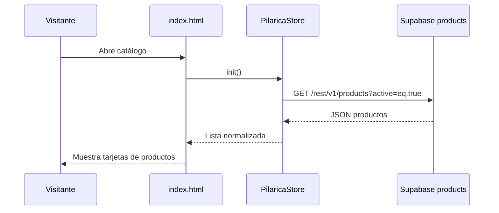
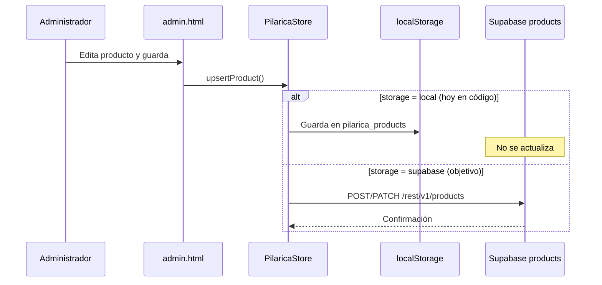
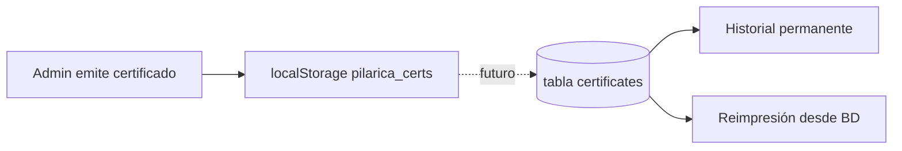
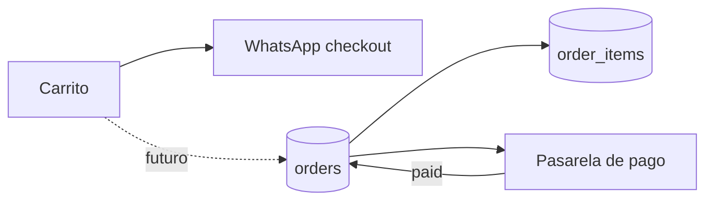

# Pilarica — Documentación de Base de Datos

**Proyecto:** Tienda en línea + Panel administrativo  
**Motor:** PostgreSQL (Supabase)  
**Fecha:** Julio 2025  
**Estado:** Fase 1 en producción parcial — catálogo en la nube; pagos y escritura admin pendientes

---

## 1. Resumen ejecutivo

Pilarica utiliza **Supabase** como backend: una base de datos PostgreSQL en la nube con API REST automática, autenticación y almacenamiento de archivos. Esto permite:

- Tener un **catálogo centralizado** accesible desde la tienda pública (`index.html`)
- Gestionar inventario, certificados y pedidos desde un **panel admin** (`admin.html`)
- Escalar sin montar un servidor propio
- Activar pagos y usuarios reales en fases posteriores

**Lo que ya funciona hoy**

| Módulo | Estado |
|--------|--------|
| Proyecto Supabase creado | ✅ |
| Tablas y relaciones definidas | ✅ |
| Tienda lee catálogo desde Supabase | ✅ |
| Productos de demostración cargados (`seed.sql`) | ✅ |
| Seguridad básica (Row Level Security) | ✅ |

**Lo que falta (acordado para fases siguientes)**

| Módulo | Estado |
|--------|--------|
| Admin escribe inventario en Supabase | ✅ |
| Certificados guardados en base de datos | ⏳ Pendiente |
| Login admin con Supabase Auth | ✅ (requiere setup-admin.sql) |
| Subida de imágenes a Supabase Storage | ⏳ Pendiente |
| Pedidos y pagos en línea | ⏳ Fase 2 |

---

## 2. Herramienta elegida: Supabase

### ¿Por qué Supabase?

| Criterio | Supabase |
|----------|----------|
| Tipo de base | PostgreSQL relacional (ideal para catálogo, pedidos, certificados) |
| API | REST automática — compatible con el sitio HTML actual |
| Autenticación | Incluida para admin y futuros clientes |
| Imágenes | Storage para fotos de productos |
| Costo inicial | Plan gratuito suficiente para arrancar |
| Mantenimiento | Sin servidor propio que administrar |

### Infraestructura del proyecto

```
Sitio web (HTML estático)
    │
    ├── index.html      → Tienda pública
    ├── admin.html      → Panel administrativo
    └── js/
            ├── pilarica-config.js   → Configuración (URL, claves, modo)
            └── pilarica-store.js    → Capa de datos compartida

                    │
                    │  HTTPS / REST API
                    ▼

            Supabase (PostgreSQL)
            ├── Tablas de negocio
            ├── auth.users (usuarios)
            ├── Row Level Security
            └── Storage (futuro: imágenes)
```

### Archivos SQL del repositorio

| Archivo | Propósito |
|---------|-----------|
| `database/schema.sql` | Crea tablas, índices, triggers y políticas de seguridad |
| `database/seed.sql` | Inserta 8 productos de demostración (opcional) |
| `database/DOCUMENTACION-BASE-DE-DATOS.md` | Este documento |

---

## 3. Modelo Entidad-Relación (completo)

### 3.1 Diagrama principal

```mermaid
erDiagram
    AUTH_USERS ||--o| ADMIN_PROFILES : "1 a 0..1"
    AUTH_USERS ||--o{ CERTIFICATES : "emite 0..N"
    PRODUCTS ||--o{ CERTIFICATES : "certifica 0..N"
    PRODUCTS ||--o{ ORDER_ITEMS : "referencia 0..N"
    ORDERS ||--|{ ORDER_ITEMS : "contiene 1..N"

    AUTH_USERS {
        uuid id PK "Supabase Auth (sistema)"
        text email
        timestamptz created_at
    }

    ADMIN_PROFILES {
        uuid user_id PK_FK
        text full_name
        text role "admin | staff"
        timestamptz created_at
    }

    PRODUCTS {
        uuid id PK
        text sku UK "Ej: PIL-001"
        text name
        text category "anillos|collares|aretes|pulseras"
        text description
        text material
        text stone
        text size
        numeric price
        text currency "MXN"
        text image_url
        boolean featured
        boolean in_stock
        boolean active
        timestamptz created_at
        timestamptz updated_at
    }

    CERTIFICATES {
        uuid id PK
        text serial UK "Ej: PIL-101"
        uuid product_id FK "nullable"
        text product_name "copia al emitir"
        text material
        text stone
        text size
        text price_label
        text client_name
        date purchase_date
        timestamptz issued_at
        uuid issued_by FK "nullable"
    }

    ORDERS {
        uuid id PK
        text order_number UK
        text status
        text customer_name
        text customer_email
        text customer_phone
        numeric subtotal
        text currency
        text notes
        timestamptz created_at
        timestamptz updated_at
    }

    ORDER_ITEMS {
        uuid id PK
        uuid order_id FK
        uuid product_id FK "nullable"
        text sku "snapshot"
        text name "snapshot"
        numeric unit_price "snapshot"
        int quantity
    }
```

### 3.2 Entidades externas (no creadas por nosotros)

| Entidad | Origen | Rol |
|---------|--------|-----|
| `auth.users` | Supabase Auth | Cuentas de administradores (y futuros clientes) |
| Supabase Storage | Supabase | Bucket para imágenes de productos (futuro) |

### 3.3 Datos que hoy viven fuera de la base (temporal)

| Dato | Ubicación actual | Tabla destino |
|------|------------------|---------------|
| Carrito de compras | `localStorage` del navegador | `orders` + `order_items` |
| Certificados emitidos | `localStorage` (`pilarica_certs`) | `certificates` |
| Sesión admin demo | `sessionStorage` | `auth.users` + `admin_profiles` |
| Productos editados desde admin | `localStorage` (si no hay escritura Supabase) | `products` |

---

## 4. Descripción detallada de cada tabla

### 4.1 `products` — Catálogo de joyas

**Propósito:** Fuente de verdad del inventario visible en la tienda.

| Columna | Tipo | Obligatorio | Descripción |
|---------|------|-------------|-------------|
| `id` | uuid | Sí | Identificador interno (PK) |
| `sku` | text | Sí | Código de pieza único, ej. `PIL-001` |
| `name` | text | Sí | Nombre comercial |
| `category` | text | Sí | `anillos`, `collares`, `aretes` o `pulseras` |
| `description` | text | No | Descripción para ficha de producto |
| `material` | text | No | Ej. Oro 18k, Oro Blanco 18k |
| `stone` | text | No | Ej. Diamantes, Zafiro |
| `size` | text | No | Ej. Talla 14, 42 cm |
| `price` | numeric(12,2) | Sí | Precio en moneda indicada |
| `currency` | text | Sí | Por defecto `MXN` |
| `image_url` | text | No | Ruta o URL de la fotografía |
| `featured` | boolean | Sí | Si aparece en destacados del inicio |
| `in_stock` | boolean | Sí | Disponible / agotado |
| `active` | boolean | Sí | Visible en tienda pública |
| `created_at` | timestamptz | Sí | Fecha de alta |
| `updated_at` | timestamptz | Sí | Última modificación (trigger automático) |

**Índices:** por `category` y por `featured` (solo destacados).

**Nota de diseño:** Las categorías están como campo de texto con restricción (`CHECK`), no como tabla separada. Es suficiente para 4 categorías fijas; si el catálogo crece mucho, se puede normalizar a una tabla `categories`.

---

### 4.2 `certificates` — Certificados de autenticidad

**Propósito:** Registro permanente de cada certificado impreso para un cliente.

| Columna | Tipo | Obligatorio | Descripción |
|---------|------|-------------|-------------|
| `id` | uuid | Sí | PK |
| `serial` | text | Sí | Folio único, ej. `PIL-101` |
| `product_id` | uuid | No | FK → `products.id` |
| `product_name` | text | Sí | Copia del nombre al momento de emitir |
| `material` | text | No | Copia al emitir |
| `stone` | text | No | Copia al emitir |
| `size` | text | No | Copia al emitir |
| `price_label` | text | No | Precio formateado en el certificado |
| `client_name` | text | Sí | Nombre del comprador |
| `purchase_date` | date | Sí | Fecha de compra |
| `issued_at` | timestamptz | Sí | Fecha de emisión |
| `issued_by` | uuid | No | FK → `auth.users.id` (admin que emitió) |

**¿Por qué se copian datos del producto?**  
Un certificado es un documento legal/histórico. Si después se edita o elimina la pieza del catálogo, el certificado ya emitido **no debe cambiar**.

**Relaciones:**
- `product_id` → `products` (`ON DELETE SET NULL`)
- `issued_by` → `auth.users`

---

### 4.3 `admin_profiles` — Perfiles de administración

**Propósito:** Define quién tiene permisos de administrador en el sistema.

| Columna | Tipo | Obligatorio | Descripción |
|---------|------|-------------|-------------|
| `user_id` | uuid | Sí | PK y FK → `auth.users.id` |
| `full_name` | text | No | Nombre del administrador |
| `role` | text | Sí | `admin` (acceso total) o `staff` (futuro: permisos limitados) |
| `created_at` | timestamptz | Sí | Alta del perfil |

**Flujo de alta de un admin (futuro):**
1. Crear usuario en Supabase → Authentication
2. Insertar fila en `admin_profiles` con `role = 'admin'`
3. Ese usuario puede crear/editar productos y certificados vía API

---

### 4.4 `orders` — Pedidos (Fase 2)

**Propósito:** Registrar compras. Tabla creada; lógica de checkout y pagos pendiente.

| Columna | Tipo | Descripción |
|---------|------|-------------|
| `id` | uuid | PK |
| `order_number` | text | Número legible, ej. `ORD-2025-0042` |
| `status` | text | Ver estados abajo |
| `customer_name` | text | Nombre del cliente |
| `customer_email` | text | Correo |
| `customer_phone` | text | Teléfono / WhatsApp |
| `subtotal` | numeric | Total antes de envío |
| `currency` | text | `MXN` |
| `notes` | text | Notas internas o del cliente |
| `created_at` / `updated_at` | timestamptz | Auditoría |

**Estados de `status`:**

| Valor | Significado |
|-------|-------------|
| `draft` | Borrador (carrito convertido, sin pagar) |
| `pending` | Esperando confirmación de pago |
| `paid` | Pagado |
| `shipped` | Enviado |
| `cancelled` | Cancelado |

**Hoy:** el carrito funciona en el navegador y el checkout se canaliza por WhatsApp, sin escribir en esta tabla.

---

### 4.5 `order_items` — Líneas de pedido (Fase 2)

**Propósito:** Detalle de cada pieza dentro de un pedido.

| Columna | Tipo | Descripción |
|---------|------|-------------|
| `id` | uuid | PK |
| `order_id` | uuid | FK → `orders.id` (`ON DELETE CASCADE`) |
| `product_id` | uuid | FK → `products.id` (opcional, `ON DELETE SET NULL`) |
| `sku` | text | Copia del SKU al momento de comprar |
| `name` | text | Copia del nombre |
| `unit_price` | numeric | Precio unitario al momento de comprar |
| `quantity` | int | Cantidad (mínimo 1) |

**¿Por qué snapshot de precio y nombre?**  
Igual que en certificados: el pedido histórico no debe cambiar si después se modifica el catálogo.

---

## 5. Diagrama de relaciones (cardinalidad)

```
auth.users (1) ────── (0..1) admin_profiles
auth.users (1) ────── (0..N) certificates.issued_by

products (1) ──────── (0..N) certificates.product_id
products (1) ──────── (0..N) order_items.product_id

orders (1) ────────── (1..N) order_items.order_id
```

| Relación | Tipo | Comportamiento al borrar |
|----------|------|--------------------------|
| admin_profiles → auth.users | 1:1 | CASCADE (si se borra el usuario, se borra el perfil) |
| certificates → products | N:1 | SET NULL (el certificado sobrevive) |
| certificates → auth.users | N:1 | Sin cascade (referencia histórica) |
| order_items → orders | N:1 | CASCADE (si se borra el pedido, se borran las líneas) |
| order_items → products | N:1 | SET NULL (el pedido conserva snapshot) |

---

## 6. Seguridad — Row Level Security (RLS)

Supabase aplica políticas a nivel de fila para controlar quién lee y escribe cada tabla.

### Políticas actuales

| Tabla | Política | Quién | Permiso |
|-------|----------|-------|---------|
| `products` | Public read active products | Visitante (clave `anon`) | `SELECT` solo si `active = true` |
| `products` | Admin manage products | Usuario en `admin_profiles` con `role = admin` | `SELECT`, `INSERT`, `UPDATE`, `DELETE` |
| `certificates` | Admin manage certificates | Usuario en `admin_profiles` | CRUD completo |

### Tablas sin políticas públicas (bloqueadas por defecto)

- `orders`
- `order_items`
- `admin_profiles`

Esto es intencional: los pedidos y perfiles admin no deben ser accesibles desde la tienda pública.

### Claves de API

| Clave | Uso | ¿Dónde va? |
|-------|-----|------------|
| **anon (public)** | Tienda y lectura pública | `js/pilarica-config.js` — segura en navegador con RLS |
| **service_role (secret)** | Solo backend / scripts | Nunca en el código del sitio |

---

## 7. Flujo de datos por módulo

### 7.1 Tienda pública (`index.html`) — ACTIVO



### 7.2 Panel admin — inventario — PENDIENTE escritura en nube



**Situación actual:** la tienda **lee** de Supabase; el admin **aún no escribe** en Supabase. Los cambios del admin quedan en el navegador (`localStorage`) y no se reflejan en la base ni en otros dispositivos.

### 7.3 Certificados — PENDIENTE migración



### 7.4 Pedidos y pagos — FASE 2



---

## 8. Mapa de implementación por fases

### Fase 1 — Catálogo en la nube (actual)

- [x] Proyecto Supabase
- [x] Esquema SQL (`schema.sql`)
- [x] Datos de prueba (`seed.sql`)
- [x] Tienda lee productos vía API REST
- [x] RLS básico en productos y certificados
- [ ] Admin escribe en `products`
- [ ] Imágenes en `image_url` completas
- [ ] Supabase Storage para fotos

### Fase 2 — Operación completa

- [ ] Login admin con Supabase Auth
- [ ] Alta de admins en `admin_profiles`
- [ ] Certificados persistidos en `certificates`
- [ ] Pedidos en `orders` + `order_items`
- [ ] Integración de pagos (Stripe / Mercado Pago u otro)
- [ ] Políticas RLS para pedidos

### Fase 3 — Escala (opcional)

- [ ] Tabla `categories` si el catálogo crece
- [ ] Cuentas de clientes (`auth.users` + perfil cliente)
- [ ] Historial de pedidos por cliente
- [ ] Reportes y analytics

---

## 9. Cómo ver el modelo en Supabase

1. Iniciar sesión en [supabase.com](https://supabase.com) → proyecto **pilarica**
2. **Table Editor** — ver filas y columnas de cada tabla
3. **Database → Tables** — abrir una tabla → pestaña de relaciones / foreign keys
4. **SQL Editor** — consultas de verificación, por ejemplo:

```sql
-- Ver todos los productos
select sku, name, category, price, featured, in_stock, active
from products
order by sku;

-- Ver relaciones de certificados (cuando haya datos)
select c.serial, c.client_name, p.sku, p.name
from certificates c
left join products p on p.id = c.product_id;
```

---

## 10. Productos de demostración (`seed.sql`)

| SKU | Nombre | Categoría | Precio MXN | Imagen en BD |
|-----|--------|-----------|------------|--------------|
| PIL-001 | Collar Candy Baguette | collares | 48,500 | Sin URL (placeholder en tienda) |
| PIL-002 | Pulsera Marquise Star | pulseras | 62,000 | Sin URL |
| PIL-003 | Collar Doble Corazón | collares | 55,000 | Sin URL |
| PIL-004 | Anillo Pear Bicolor | anillos | 38,000 | Sin URL |
| PIL-005 | Aretes Corazón Zafiro | aretes | 42,000 | Sin URL |
| PIL-006 | Collar Tennis Diamantes | collares | 72,000 | `assets/products/collares/...` |
| PIL-007 | Collar Cruz Zafiro | collares | 58,000 | `assets/products/collares/...` |
| PIL-008 | Stack Anillos Oro & Diamante | anillos | 45,000 | `assets/products/anillos/...` |

Las piezas PIL-001 a PIL-005 muestran icono placeholder porque `image_url` está vacío. Se resuelve subiendo fotos y actualizando ese campo, o usando Supabase Storage.

---

## 11. Configuración en el código

Archivo: `js/pilarica-config.js`

```javascript
const PilaricaConfig = {
  storage: 'supabase',   // 'local' | 'supabase'
  supabase: {
    url: 'https://TU_PROYECTO.supabase.co',  // sin /rest/v1/
    anonKey: '...',                           // clave anon public
  },
};
```

| Modo | Comportamiento |
|------|----------------|
| `local` | Todo en `localStorage` del navegador (desarrollo / pruebas) |
| `supabase` | Tienda lee de PostgreSQL; escritura admin pendiente de conectar |

---

## 12. Glosario

| Término | Significado |
|---------|-------------|
| **SKU** | Stock Keeping Unit — código único de pieza (`PIL-001`) |
| **RLS** | Row Level Security — seguridad por fila en PostgreSQL |
| **FK** | Foreign Key — llave foránea, relaciona tablas |
| **PK** | Primary Key — identificador único de fila |
| **Snapshot** | Copia de datos en el momento de una transacción (pedido, certificado) |
| **anon key** | Clave pública de Supabase para el navegador |
| **API REST** | Interfaz HTTP para leer/escribir datos (`/rest/v1/products`) |

---

## 13. Contacto técnico y archivos

| Recurso | Ubicación |
|---------|-----------|
| Esquema SQL | `database/schema.sql` |
| Datos iniciales | `database/seed.sql` |
| Configuración | `js/pilarica-config.js` |
| Capa de datos | `js/pilarica-store.js` |
| Tienda | `index.html` |
| Admin | `admin.html` |

---

*Documento generado para presentación interna — Pilarica Joyería de Autor.*
